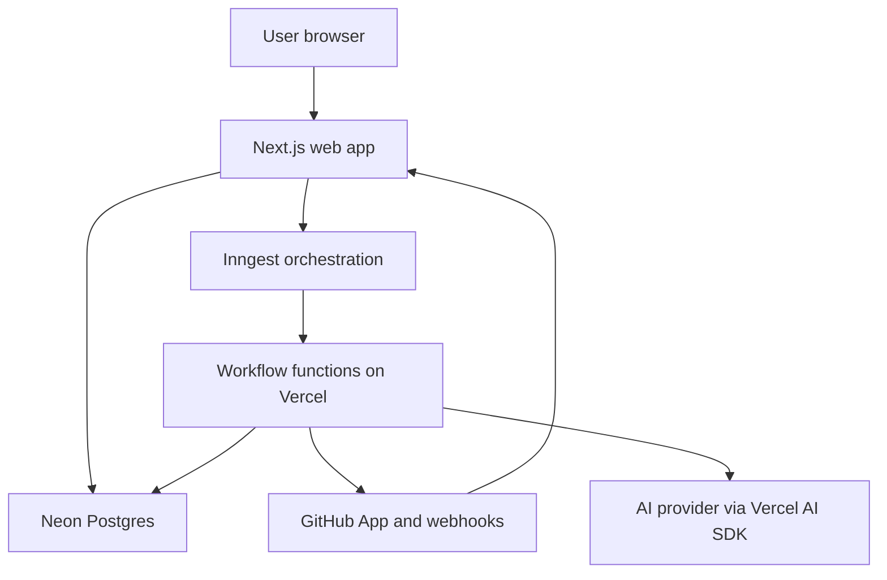

# AI GitHub Review Agent — Product and Engineering Plan

Status: confirmed scope  
Date: 2026-08-20  
Target: a security-first, CodeRabbit-style GitHub review product built as an original implementation

## 1. Product goal

Build a multi-tenant SaaS application that:

1. Lets a user sign in and enter a dashboard.
2. Lets an authorized user install a GitHub App and select repositories the app may access.
3. Lets an admin explicitly enable reviews per repository.
4. Indexes the repository at a specific commit and maintains the index incrementally.
5. Reviews pull requests with repository-wide context, publishes precise inline comments, and submits `APPROVE`, `COMMENT`, or `REQUEST_CHANGES` as appropriate.
6. Supports contextual chat in PR comments and review threads.
7. Learns repository and team preferences from explicit feedback without unsafe cross-tenant or online model training.
8. Can propose fixes, create a branch, commit changes, and open a draft PR when an authorized user explicitly asks.
9. Can merge or enqueue an eligible PR only when deterministic repository policy, GitHub protections, CI, and configured human-approval rules all permit it.

This is a capability-compatible product, not a copy of another company's branding, source code, prompts, or UI.

## 2. Decisions made up front

| Area | Decision | Reason |
| --- | --- | --- |
| Architecture | Modular Next.js application with Inngest durable workflows | Keeps deployment and ownership simple while moving retries, checkpoints, fan-out, cancellation, and workflow observability out of request handlers. |
| Monorepo | Turborepo with pnpm workspaces | Shared types, schemas, UI, linting, and build cache without microservice overhead. |
| Frontend | Next.js App Router, shadcn/ui, Tailwind CSS, Lucide icons | Matches the requested stack; no emoji-based controls or status indicators. |
| Internal API | tRPC v11 with Zod schemas | End-to-end types for dashboard clients and shared validation. |
| External API | [`trpc-to-openapi`](https://github.com/mcampa/trpc-to-openapi) v3.x, pinned to an exact compatible version | It supports tRPC 11 and Zod 4. Generate and test the OpenAPI contract in CI. Track [official `@trpc/openapi`](https://trpc.io/docs/openapi), but do not adopt its alpha release for production yet. |
| API docs | OpenAPI 3.1 JSON plus Scalar documentation UI | Searchable, testable backend documentation from the same Zod contracts. |
| Database | Neon Postgres, Drizzle ORM, `pgvector`, Postgres full-text search | One durable data system for application data, metadata, lexical search, and embeddings. |
| GitHub integration | GitHub Apps with Octokit | Repository-scoped installations, webhook identity, short-lived installation tokens, and Checks/Reviews APIs. |
| Review languages | Major-language support at launch | Every listed language family receives dedicated parsing/chunking, language-aware review rules, framework context, inline-comment validation, and its own quality evaluation gate. |
| AI | Vercel AI SDK with provider/model adapters | Provider-neutral structured output, embeddings, streaming chat, and bounded tool loops. |
| Workflows | [Inngest](https://www.inngest.com/docs/learn/inngest-functions) with TypeScript event schemas and durable steps | Provides retries, checkpointed steps, idempotency, concurrency control, cancellation, fan-out, and traces without operating Redis or a custom worker queue. |
| Review execution | Fixed, observable review pipeline; bounded agent loop only for PR chat | Easier to test, cheaper, and safer than giving a free-running agent direct GitHub access. |
| Learning | Scoped, versioned memory records promoted from feedback | “Self-learning” behavior without mutating model weights or mixing customer data. |
| Code writes | Separate, optional elevated GitHub App installation | A read/review installation should not receive repository content-write permission merely to support an optional fix feature. |
| Merge | Disabled by default; policy engine owns the decision | The model may recommend a disposition, but it never has unilateral merge authority. |

### 2.1 Confirmed product choices

- Public multi-tenant SaaS.
- GitHub.com only; no GitHub Enterprise Server support in the initial release.
- Major-language support is required at launch: TypeScript/JavaScript, Python, Java/Kotlin/Groovy, Go, C/C++/Objective-C, C#/F#, Rust, Ruby, PHP, Swift, Dart, Scala, SQL, Bash/PowerShell, Elixir/Erlang, Lua, R, Perl, Haskell/OCaml, Julia, Solidity, COBOL/Fortran, and common web/configuration/IaC formats. Section 8.3 defines the exact launch matrix and quality contract.
- Vercel AI SDK is the AI integration layer; model/provider selection remains configuration behind named aliases.
- Inngest is the workflow engine and Vercel is the workflow compute host.
- Interaction order is review first, then contextual chat. Mutating agent actions happen only after an authorized user asks in chat.
- Approval and merge behavior is configurable in the repository UI.
- Durable repository data, review history, chat, and memories remain until an authorized user deletes them from Settings. Transient transport data follows minimal provider/security retention.
- All original requirements ship as one complete initial release. There is no reduced v1 followed by a v2 for the required scope.

## 3. Scope

### 3.1 Required for the initial release

- GitHub sign-in and durable user sessions.
- Workspace, membership, and role model.
- Reviewer GitHub App installation and repository selection.
- Per-repository enable/disable and review configuration.
- Full initial index and commit-aware incremental indexing.
- Dedicated indexing and review support for every major language family in the launch matrix; generic text-only analysis does not count as launch support.
- Automatic review on PR open, reopen, ready-for-review, and synchronize.
- PR summary, risk assessment, inline comments, non-inline findings, and review decision.
- Incremental re-review without repeating resolved or unchanged comments.
- PR timeline chat and review-thread replies.
- Explicit feedback and a repository/team memory layer.
- Optional fix branch and draft PR creation through an elevated executor installation.
- Guarded approve, request-changes, and merge/merge-queue behavior.
- Dashboard for repositories, index status, reviews, learnings, settings, and audit events.
- tRPC API, selected OpenAPI endpoints, and backend API documentation.
- Auditability, tenant isolation, deletion controls, observability, rate limits, and cost limits.

### 3.2 Deliberately excluded from the initial release

- GitLab, Bitbucket, Azure DevOps, or local IDE integrations.
- Kubernetes, independently deployed microservices, Kafka, or a separate vector database.
- Arbitrary shell access or arbitrary Octokit method execution by the model.
- Running untrusted repository build scripts in a request or workflow-function process.
- Direct pushes to default/protected branches, force-pushes, repository settings changes, secret changes, or workflow-file changes.
- Online fine-tuning from customer comments.
- Autonomous merge enabled by default.
- Billing, marketplace listing, and enterprise SSO until product fit requires them.

These exclusions are YAGNI boundaries, not permanent limitations.

## 4. System architecture



### 4.1 Deployment units

- `apps/web`: Next.js dashboard, tRPC HTTP handler, authentication callbacks, GitHub App setup callbacks, raw GitHub webhook receiver, `/api/inngest` serve handler, OpenAPI document, and API docs.
- `packages/workflows`: Inngest client, versioned event schemas, durable functions, step boundaries, concurrency/cancellation rules, and failure handlers.
- Neon Postgres: product data, workflow business projections/outbox, code index, vector index, and audit data.
- Inngest Cloud: event delivery, workflow orchestration, retry/checkpoint state, cancellation, flow control, and traces. Workflow code still executes on the application's Vercel compute.
- AI provider: accessed only through server-side Vercel AI SDK adapters.

Recommended deployment shape:

- Vercel for `apps/web`.
- Inngest Cloud for durable workflow orchestration, with the signed Next.js serve handler at `/api/inngest`.
- Neon for Postgres, with separate pooled and direct migration connections.
- A managed secret store for GitHub App private keys, OAuth secrets, database credentials, and model credentials.

Keep Inngest behind typed domain events and workflow entry points. Product use cases must not depend on Inngest event payload internals.

### 4.2 Monorepo layout

```text
.
├── apps/
│   └── web/
├── packages/
│   ├── api/          # tRPC routers, procedures, Zod DTOs, OpenAPI metadata
│   ├── db/           # Drizzle schema, queries, migrations, tenant scoping
│   ├── github/       # Octokit clients, auth, webhooks, GitHub DTO adapters
│   ├── ai/           # model registry, prompts, review pipeline, retrieval, memory
│   ├── workflows/    # Inngest client, event schemas, functions, flow control
│   ├── ui/           # shadcn components and shared dashboard UI
│   └── config/       # tsconfig, ESLint, Tailwind, environment validation
├── tooling/
│   ├── fixtures/     # webhook and PR fixtures with secrets removed
│   └── evals/        # seeded defects and expected review outcomes
├── turbo.json
├── pnpm-workspace.yaml
└── package.json
```

Do not create one package per domain on day one. Keep indexer, memory, review, and action modules inside `packages/ai`; `packages/workflows` should contain orchestration only, not duplicated domain logic.

## 5. Authentication, tenancy, and repository connection

### 5.1 Identity flow

1. User selects **Continue with GitHub**.
2. Use the GitHub App user authorization flow for identity. Validate OAuth `state`; use PKCE if supported by the chosen auth adapter.
3. Create or update the user, account, and session records.
4. Create a personal workspace on first login or show workspaces the user belongs to.
5. Redirect authenticated users to `/dashboard`; unauthenticated dashboard requests redirect to `/login`.

The user session proves product identity. It does not grant repository access by itself.

### 5.2 Repository authorization flow

1. An owner/admin selects **Connect repositories**.
2. Redirect to the Reviewer GitHub App installation page.
3. The installer selects an account and either selected repositories or all repositories.
4. On callback, validate signed state and bind the returned installation only to the active workspace.
5. Use an installation token to sync repositories. Show only the intersection of:
   - repositories granted to the installation;
   - repositories visible to the acting user where user-level visibility is required; and
   - repositories the workspace has not disabled.
6. The admin explicitly enables a repository for review.
7. Create an immutable configuration revision, enqueue initial indexing, and show progress.
8. If a PR arrives before the first index is active, queue the review until the base snapshot is ready or run a clearly marked diff-only review if the repository opted into that fallback.

[GitHub installation access tokens expire after one hour](https://docs.github.com/en/apps/creating-github-apps/authenticating-with-a-github-app/authenticating-as-a-github-app-installation). Generate them just in time, keep them in memory only, and never store them in Postgres or logs.

### 5.3 Roles

| Role | Capabilities |
| --- | --- |
| Owner | Manage workspace, installations, members, retention, API keys, executor access, merge policy, and deletion. |
| Admin | Manage repositories, policies, active learnings, and most members; cannot transfer/delete the workspace. |
| Maintainer | View reviews, run reviews/chat, submit feedback, and request enabled write actions. |
| Viewer | Read dashboard data and review history. |

For commands received from GitHub, re-check the actor's current GitHub repository permission at execution time. A PR commenter who is not an authorized collaborator cannot make the bot write code or merge.

## 6. GitHub App design

### 6.1 Reviewer App — default installation

Request the minimum repository permissions needed for the enabled features, following [GitHub's least-privilege guidance](https://docs.github.com/en/apps/creating-github-apps/registering-a-github-app/choosing-permissions-for-a-github-app):

| Permission | Level | Purpose |
| --- | --- | --- |
| Metadata | Read | Repository identity and installation metadata. |
| Contents | Read | Index source and retrieve base/head context. |
| Pull requests | Write | Read diffs and publish reviews, inline comments, and review replies. |
| Issues | Write | Read and reply to PR timeline comments because PR timeline comments use the Issues API. |
| Checks | Write | Publish an optional review check and gate state. |
| Actions | Read, optional | Read workflow/check outcomes and explain CI failures. |

Do not request Administration, Secrets, Environments, Deployments, Members, or Workflows-write permissions for the initial release.

Subscribe only to required events:

- `installation`, `installation_repositories`, `repository`
- `push`
- `pull_request`
- `pull_request_review`
- `pull_request_review_comment`
- `pull_request_review_thread` if available for the installation type
- `issue_comment`
- `check_run`, `check_suite`, or `workflow_run` only if CI awareness is enabled
- `merge_group` only when merge-queue support is enabled

### 6.2 Executor App — optional elevated installation

The optional Executor App adds `Contents: write` and `Pull requests: write` for creating branches, commits, draft PRs, and eligible merges. It must:

- be installed separately and only on repositories that need agent writes;
- be disabled per repository until an owner/admin enables a specific action policy;
- never request `Workflows: write` in the initial release;
- refuse any patch that adds or changes `.github/workflows/**`, credential files, protected paths, or generated secret material;
- use expected SHAs for compare-and-swap protection before any commit or merge;
- record every proposed and executed action in an append-only audit trail.

This separation adds setup work, but it prevents every review-only customer from granting source-write permission.

### 6.3 Octokit boundaries

- Build a fresh installation-authenticated Octokit client per job or request.
- Use `@octokit/auth-app`, webhook helpers, retry, and throttling plugins.
- Pin a tested GitHub REST API version.
- Map Octokit responses into internal DTOs in `packages/github`; domain code must not depend on large GitHub response shapes.
- Expose narrow methods such as `getPullRequestContext`, `createReview`, and `createDraftFixPullRequest`, not a raw Octokit client, to the AI layer.
- Respect primary and secondary rate limits, `Retry-After`, ETags, and conditional requests.

## 7. Webhook ingestion and Inngest workflows

### 7.1 Receiver requirements

1. Read the exact raw request body.
2. Verify `X-Hub-Signature-256` using constant-time comparison before parsing or sending an event.
3. Validate expected GitHub event headers and content type.
4. In one database transaction, insert:
   - a webhook inbox record with a unique `X-GitHub-Delivery` constraint; and
   - a `workflow_outbox` row containing a versioned internal event name and minimal identifiers.
5. Send the outbox event to Inngest using the delivery-derived event ID, then mark the outbox row published.
6. If event delivery fails, leave the outbox row pending; a scheduled reconciler retries it.
7. Return `202` quickly. Never perform indexing or AI work in the webhook request.

Duplicate deliveries must be harmless. Invalid signatures receive `401`; unsupported events receive a successful no-op response so GitHub does not retry them unnecessarily. Do not send raw private source, complete diffs, prompts, access tokens, or full webhook payloads to Inngest. Events carry IDs, repository/PR numbers, commit SHAs, configuration revisions, and correlation IDs; workflow steps fetch authorized data when they execute.

### 7.2 Inngest guarantees and configuration

- Use versioned Zod schemas for every event in `packages/workflows`.
- Set an event `id` and function-level idempotency key for logical operations such as `index:{repoId}:{commitSha}` and `review:{repoId}:{prNumber}:{headSha}:{configRevision}`. [Inngest supports event and function idempotency](https://www.inngest.com/docs/guides/handling-idempotency), but database uniqueness remains the final publication/write safeguard.
- Wrap side effects in stable, named `step.run` checkpoints. A retried step must be idempotent and must re-check current authorization and expected SHA.
- Use per-workspace and per-installation [concurrency keys](https://www.inngest.com/docs/functions/concurrency) to protect Neon, GitHub rate limits, and model budgets.
- Use debounce for rapid PR `synchronize` events, but always review the latest head SHA.
- Use throttling for GitHub/model throughput; do not use rate limiting where skipping an event would lose required work.
- Use `cancelOn` with repository-disabled, repository-deleted, PR-closed, and PR-head-updated events. Because an executing step may finish after cancellation, every publish/write step still checks active state and current SHA.
- Use `step.invoke` for coordinated child workflows and `step.sendEvent` for independent fan-out.
- Configure step/function timeouts, bounded retries, `onFailure`, cleanup handlers, and operational alerts.
- Store business status and output references in Neon. Do not return large chunks/diffs from steps: Inngest retains event/run state and enforces payload/state limits.
- The `/api/inngest` Next.js handler uses the SDK `serve` adapter and environment-specific signing keys. [Inngest signs requests and its SDK verifies the signature and replay timestamp](https://www.inngest.com/docs/learn/security).

### 7.3 Workflow catalog

| Event/function | Purpose | Key controls |
| --- | --- | --- |
| `repository/index.requested` | Build the first commit-specific repository index. | Idempotency by repository/commit/parser/embedding version; shard by subtree/package. |
| `repository/index.incremental` | Reuse unchanged blobs and index pushed changes. | Debounce branch pushes; cancel superseded runs. |
| `pull-request/review.requested` | Run the complete review pipeline and publish one coherent review. | Idempotency by PR/head/config; cancel on newer head; serialize publication. |
| `pull-request/chat.requested` | Answer an authorized user after the first review exists. | Actor permission check; bounded tools/steps/cost. |
| `review/feedback.received` | Record rating and propose a scoped memory candidate. | Immutable feedback event; no automatic broad promotion. |
| `agent/fix.requested` | Produce a protected, audited patch and draft PR after a chat request. | Executor App, explicit intent, expected SHA, sandbox, protected-path rules. |
| `pull-request/merge.evaluate` | Re-evaluate deterministic merge policy after review/check changes. | UI-configured mode; exact SHA; GitHub remains final enforcement point. |
| `workspace/data.delete` | Purge selected repository/workspace data after UI confirmation. | Re-authentication, typed confirmation, cancellation, audit, verification. |
| Scheduled outbox reconciler | Re-send pending workflow events. | Stable event IDs make replay harmless. |

### 7.4 Long-workflow design on Vercel

- Split repository enumeration, blob parsing, embedding batches, concern analysis, and publication into bounded durable steps or invoked functions.
- Fan out independent language packages/modules/files in controlled batches and join only small result references.
- Persist large artifacts and intermediate review state in Neon, returning IDs from steps.
- Use Inngest traces for orchestration debugging and product-owned workflow projections for the customer dashboard.
- Local development uses the Inngest Dev Server with deterministic webhook and PR fixtures.

## 8. Repository indexing

### 8.1 Indexing objective

The index must answer more than “which text looks similar?” It should recover exact symbols, imports, callers, tests, contracts, configuration, migrations, documentation, and semantically related code at the PR's base commit.

### 8.2 Full index pipeline

1. Resolve repository identity, default branch, head commit, and root tree SHA with Octokit.
2. Enumerate the Git tree. If the recursive tree response is truncated, walk subtrees explicitly.
3. Apply path and content filters before downloading or embedding:
   - honor product defaults, repository configuration, and relevant `.gitignore` rules;
   - exclude binaries, archives, vendored dependencies, build output, coverage output, minified files, generated assets, and lockfiles from embeddings;
   - cap individual file size and total index size;
   - scan for likely secrets and exclude/redact them;
   - follow no symlinks and reject unsafe paths.
4. Fetch only unseen Git blob SHAs. Content-addressed deduplication avoids re-reading unchanged files across commits.
5. Detect language, dialect/version, generated-code status, package/module boundaries, manifests, workspace/project references, and embedded-language regions.
6. Select a versioned language adapter. Each adapter uses the safest available compiler AST, language-native parser, or static-analysis API for semantic information, with Tree-sitter/WASM syntax parsing as a resilient fallback for incomplete or oversized projects.
7. Chunk on semantic boundaries: module, class, function, method, type, route, test, configuration block, and documentation section. Use line windows only as a fallback.
8. Extract symbols and edges:
   - definitions and references where reliable;
   - imports/exports and package dependencies;
   - routes, API schemas, database models/migrations;
   - test-to-source relationships;
   - configuration and ownership files.
9. Store lexical search documents and embeddings with `repository_id`, `snapshot_id`, path, blob SHA, symbol, language, line range, and parser version.
10. Build/refresh HNSW vector indexes and Postgres full-text indexes.
11. Validate counts, sampling, and secret filters.
12. Atomically mark the snapshot active. Never expose a half-built snapshot.

Use [Neon `pgvector`](https://neon.com/docs/extensions/pgvector) plus Postgres full-text search initially. Combine exact path/symbol matches, lexical rank, and vector similarity with reciprocal-rank fusion, then rerank the small candidate set. [Neon Lakebase Search](https://neon.com/docs/ai/lakebase-search) may replace the retrieval implementation later if its region, plan, and operational profile are suitable; keep retrieval behind an interface.

### 8.3 Major-language launch matrix

“Supported” means more than sending a diff to an LLM. Every launch language must provide:

- accurate file/dialect detection and generated-code handling;
- AST-aware semantic chunks;
- definitions, imports/dependencies, and symbol relationships where the language permits;
- framework/build/test/configuration context;
- language-specific correctness, security, compatibility, concurrency, resource-management, and testing review guidance;
- valid changed-line anchoring and suggestion formatting;
- clean-code and seeded-defect evaluation suites meeting the same launch precision/security gates;
- an explicit coverage report when project-wide semantic resolution is incomplete.

| Language family | Launch coverage | Primary semantic/parser strategy |
| --- | --- | --- |
| TypeScript and JavaScript | `.ts`, `.tsx`, `.js`, `.jsx`, `.mjs`, `.cjs`; Node.js, React, Next.js, Vue, Svelte | TypeScript Compiler API/`ts-morph`, framework SFC parsers, Tree-sitter fallback; `tsconfig`/workspace/project-reference graph. |
| Python | `.py`, typed Python, common package layouts; Django, Flask, FastAPI | Python AST plus Tree-sitter; optional isolated Pyright-compatible type graph; `pyproject.toml`/requirements/test discovery. |
| Java, Kotlin, and Groovy | JVM source, Gradle/Maven multi-module projects; Spring and common server frameworks | Java compiler/JavaParser-compatible AST, Kotlin PSI/compiler-compatible parser, and Groovy parser, with Tree-sitter fallbacks; build/module graph. |
| Go | Go modules/workspaces, services, libraries, tests | Go parser/types-compatible analysis or isolated `gopls`, Tree-sitter fallback; `go.mod`/workspace/package graph. |
| C, C++, and Objective-C | Source/headers, CMake/Xcode and common build metadata | Clang/libclang AST in a restricted parser sandbox, compilation-database support when available, Tree-sitter fallback. |
| C# and F# | .NET projects/solutions, ASP.NET, libraries, tests | Roslyn-compatible C# analysis and F# compiler-service-compatible analysis in isolated parser services; project/solution references. |
| Rust | Cargo workspaces, libraries, services, tests | Rust analyzer/`syn`-compatible parsing in isolation, Tree-sitter fallback; Cargo crate/feature graph. |
| Ruby | Ruby source, Rails, Bundler, tests | Prism-compatible AST plus Tree-sitter fallback; Gemfile/Rails convention/test mapping. |
| PHP | PHP source, Composer projects, Laravel/Symfony, tests | PHP parser-compatible AST plus Tree-sitter fallback; Composer autoload/package graph. |
| Swift | Swift packages and application/library source | SwiftSyntax-compatible parsing in an isolated service, Tree-sitter fallback; Swift package graph. |
| Dart | Dart/Flutter packages and tests | Dart analyzer-compatible parsing in isolation, Tree-sitter fallback; `pubspec.yaml` package graph. |
| Scala | Scala/SBT projects and common JVM frameworks | Scalameta-compatible parsing, Tree-sitter fallback; SBT/module graph. |
| SQL | PostgreSQL, MySQL, SQLite, SQL Server, and common migration/schema files | Dialect-aware SQL parser; schema/migration/query relationship extraction and transaction/compatibility rules. |
| Shell and PowerShell | Bash/POSIX shell, PowerShell, and common CI scripts | Tree-sitter parsers plus ShellCheck/PSScriptAnalyzer-compatible static findings; command/data-flow and quoting rules. |
| Elixir and Erlang | Mix/Rebar projects, OTP applications, Phoenix, tests | Language parsers plus Tree-sitter fallbacks; module/call/behaviour/supervision and dependency graphs. |
| Lua | Lua modules, applications, embedded scripts, tests | Lua AST/Tree-sitter parsing; module/global-state/resource and test relationships. |
| R | R packages, scripts, notebooks where extractable, tests | R parser/Tree-sitter analysis; package, data-flow, vectorization, and test relationships. |
| Perl | Perl modules, applications, distributions, tests | Perl parser/Tree-sitter analysis; package/import and test relationships. |
| Haskell and OCaml | Cabal/Stack and dune/opam projects, libraries, tests | Language AST/Tree-sitter parsing in isolation; module/type/dependency graphs where available. |
| Julia | Julia packages, scripts, scientific applications, tests | Julia parser/Tree-sitter analysis; project/manifest, multiple-dispatch, data-flow, and test relationships. |
| Solidity | Smart contracts, Foundry and Hardhat projects, tests | `solc`-compatible AST in a strict network-denied sandbox plus Tree-sitter fallback; contract/call/storage/security relationships. |
| COBOL and Fortran | Common legacy application/source layouts and build metadata | Dedicated grammar/Tree-sitter or ANTLR-compatible parsers; program/module/call/data relationships and legacy-specific review profiles. |
| Web formats | HTML, CSS, SCSS/Sass, templating files, embedded script/style blocks | Format-specific ASTs with embedded-language delegation to the matching adapter. |
| Configuration and IaC | JSON, YAML, TOML, XML, Dockerfile, Terraform/HCL, Kubernetes manifests, GitHub Actions | Format-specific parsers and schema-aware validation where a trusted schema is available; security and deployment-policy rules. |

Other detected languages receive a safe syntax/diff fallback, but they are not advertised as fully supported until they obtain a dedicated adapter and pass the same evaluation gates. The launch matrix can be expanded without changing the review engine through the `LanguageAdapter` interface.

### 8.4 Language adapter contract

```ts
interface LanguageAdapter {
  id: string;
  version: string;
  detect(file: RepositoryFile): DetectionResult;
  parse(input: ParseInput): Promise<ParsedDocument>;
  chunk(document: ParsedDocument): CodeChunk[];
  symbols(document: ParsedDocument): SymbolRecord[];
  edges(document: ParsedDocument, project: ProjectContext): SymbolEdge[];
  projectContext(files: RepositoryFile[]): Promise<ProjectContext>;
  testLinks(document: ParsedDocument, project: ProjectContext): TestLink[];
  reviewProfile(): LanguageReviewProfile;
  validateSuggestion(input: SuggestionInput): ValidationResult;
}
```

Adapters must not run repository install/build scripts. Compiler, LSP, or analyzer processes run in a network-denied, resource-limited parser sandbox without product credentials or repository-defined plugins. If semantic analysis cannot be established safely, the adapter falls back to syntax mode and records the limitation; it does not silently claim full-project understanding.

### 8.5 Incremental index pipeline

On `push` to an indexed base branch:

1. Compare the prior active commit with the new commit.
2. Reuse unchanged blob/chunk/symbol rows.
3. Parse and embed only added or modified blobs.
4. Remove snapshot mappings for deleted paths.
5. Recalculate edges touching changed symbols.
6. Create and atomically activate the new snapshot.

On installation repository removal or uninstall, immediately revoke active access and cancel workflows. Preserve the disconnected repository as read-only archived data until an owner deletes it from Settings. No further indexing, model calls, GitHub access, or agent actions may occur while disconnected.

### 8.6 PR-specific context

- Start from a snapshot matching the PR base SHA, not merely the latest default branch.
- Overlay changed head files and their new symbols.
- If the exact base snapshot is absent, build a lightweight on-demand snapshot using content-addressed rows, then continue.
- Retrieve in this order:
  1. exact changed symbols and their definitions;
  2. imports, direct callers/callees, interfaces, tests, migrations, and configuration;
  3. lexical and vector candidates;
  4. relevant repository rules and approved memories;
  5. reranked context within a strict token budget.
- Every context item carries a `path@commit` and line range so findings can cite evidence.

### 8.7 Large repository policy

- Index high-signal files first: manifests, source, tests, schemas, migrations, documentation, ADRs, and ownership/config files.
- Support configurable include/exclude globs plus language/package/project priorities.
- Report partial coverage honestly.
- Shard workflows by subtree/package, but activate only after required shards pass validation.
- Do not silently skip a truncated GitHub tree or oversized diff.

## 9. Pull request review engine

### 9.1 Review principle

Optimize for precision and developer trust, not comment count. A valid finding must be actionable, tied to evidence, relevant to the change, non-duplicative, and materially useful under repository policy.

### 9.2 Review pipeline

1. **Eligibility**
   - Ignore bot-authored loops, closed PRs, disabled repositories, unsupported drafts, excluded branches, and stale workflow runs.
   - Freeze `base_sha`, `head_sha`, PR metadata, and configuration revision.
2. **Diff normalization**
   - Fetch PR files, patches, commits, head/base content, prior reviews, unresolved threads, linked GitHub issues, checks, and ownership metadata.
   - Create a validated map of changed lines for later inline anchors.
3. **Deterministic analysis**
   - Parse changed code, detect generated/minified code, map symbols, identify risky file types, and run safe static rules that do not execute repository code.
4. **Change understanding**
   - Produce a structured summary of intent, affected components, behavior changes, data/control flow, public contracts, and likely test impact.
5. **Context planning and retrieval**
   - Generate focused retrieval queries from changed symbols and risks; retrieve exact graph neighbors and hybrid search results from the base snapshot.
6. **Concern analysis**
   - Analyze only relevant concerns: correctness, security, authorization, concurrency, transactions, compatibility, data migration, performance, reliability, observability, and tests.
   - Run concern passes in parallel only for medium/high-risk PRs; avoid a fixed swarm for small changes.
7. **Finding verification**
   - Require each candidate to include a falsifiable claim, code evidence, impact, confidence, and minimal remediation.
   - Run an adversarial verifier that attempts to disprove it using retrieved context.
   - Reject style-only, speculative, duplicated, already-discussed, stale, or non-actionable findings.
8. **Policy and severity**
   - Apply formal repository rules and approved scoped memories.
   - Classify findings as `critical`, `high`, `medium`, `low`, or `nit` and `blocking`/`non_blocking`.
9. **Publication validation**
   - Re-fetch the head SHA.
   - Validate every inline path, side, and line against the GitHub diff.
   - Publish one coherent review rather than many independent notifications.
10. **Disposition**
   - `REQUEST_CHANGES`: at least one verified blocking finding over the configured confidence threshold.
   - `COMMENT`: useful non-blocking findings, incomplete coverage, or a review that cannot safely approve.
   - `APPROVE`: no blocking findings, required coverage completed, and repository policy permits bot approval.

### 9.3 Structured finding contract

Every model-generated candidate must validate against a Zod schema similar to:

```ts
type Finding = {
  category:
    | "correctness"
    | "security"
    | "authorization"
    | "reliability"
    | "performance"
    | "compatibility"
    | "data_migration"
    | "testing"
    | "maintainability";
  severity: "critical" | "high" | "medium" | "low" | "nit";
  blocking: boolean;
  path: string;
  line: number | null;
  title: string;
  claim: string;
  evidence: Array<{ path: string; startLine: number; endLine: number; commit: string }>;
  impact: string;
  recommendation: string;
  suggestedReplacement?: string;
  confidence: number;
};
```

Invalid structured output is retried once with validation errors, then fails closed to `COMMENT`/no-publication rather than publishing malformed feedback.

### 9.4 Inline and summary comments

- Use inline comments only when the finding maps to a valid changed line.
- Use GitHub suggestion blocks only for exact, minimal replacements that preserve indentation and fit GitHub's line range.
- Put cross-file, architectural, missing-file, or general testing findings in the review summary with precise path/line citations.
- Group multiple symptoms of one root cause into one finding.
- Cap comments per review and place overflow in a collapsed dashboard report.
- On new commits, review only the delta plus unresolved prior findings. Mark findings resolved only when evidence shows the issue is fixed.

### 9.5 Review output

The PR review body should contain:

- concise change summary;
- risk level and why;
- verified blocking findings;
- non-blocking observations;
- test/CI status and missing coverage;
- review coverage limitations;
- links to the dashboard run and feedback controls.

No false claims such as “tests pass” are allowed unless a named check/test result was observed.

### 9.6 PR size handling

Default configurable bands:

| Band | Changed lines | Behavior |
| --- | ---: | --- |
| Small | up to 400 | Full pipeline, one concern pass where possible. |
| Medium | 401–1,500 | Full pipeline, risk-targeted parallel concern passes. |
| Large | 1,501–5,000 | Package/file batching, explicit coverage report, higher budget. |
| Oversized | over 5,000 | Summary and critical-risk scan; ask the author to split or request an approved high-budget review. |

Generated files and dependency lockfiles do not count equally toward model context but remain available to deterministic checks.

## 10. PR chat and agent actions

### 10.1 Chat triggers

The normal sequence is:

1. The agent completes and publishes the requested/automatic review.
2. PR chat becomes available with that review, repository context, and current head SHA.
3. The agent explains or refines findings in chat.
4. A mutating workflow starts only when an authorized user explicitly asks for it in chat.

Support explicit mentions and replies, for example:

- `@agent review`
- `@agent full review`
- `@agent explain this`
- `@agent why is this blocking?`
- `@agent suggest tests`
- `@agent fix the accepted review comments and open a draft PR`
- `@agent summarize unresolved findings`

The actual bot handle is configuration, not hard-coded in prompts.

### 10.2 Context-aware conversation

Each response may retrieve:

- PR title, body, base/head SHAs, diff, and changed files;
- the active repository snapshot and symbol graph;
- prior bot findings and human review threads;
- current CI/check state;
- formal repository instructions;
- approved, relevant team/repository memories;
- recent conversation messages within a bounded window.

Conversation state is keyed by repository, PR, and head SHA. When the head changes, old answers remain in history but are labeled as referring to the old revision.

### 10.3 Tool and action model

The model never receives a raw GitHub client. It can propose typed intents from an allowlist:

| Tier | Examples | Default authority |
| --- | --- | --- |
| Read | Search index, inspect diff, read checks, explain finding | Automatic for authorized users. |
| Review | Publish review, reply, update check | Automatic only under repository review settings. |
| Write | Create branch, commit patch, open/update draft PR | Requires Executor App, explicit user request, role check, and policy approval. |
| Merge | Enable auto-merge, enqueue merge, merge eligible PR | Disabled by default; requires explicit repository opt-in and deterministic gate. |

Every tool has input validation, a timeout, an idempotency key, a permission check, and an audit event. The Vercel AI SDK loop has a maximum number of steps, time, and model budget.

### 10.4 Fix after review and chat

When an authorized user asks the bot in chat to fix findings:

1. Resolve the exact source PR, head SHA, selected findings, requested scope, and requested destination.
2. Refuse if the source moved, the repository is read-only, the actor lacks permission, or protected paths are involved.
3. Create an ephemeral, network-restricted workspace at the source head SHA.
4. Generate a patch, apply it, and validate syntax/AST plus configured safe static checks.
5. Never place GitHub or model credentials inside the sandbox.
6. Follow the user's explicit chat request:
   - “open another PR” creates `ai/fix/pr-<number>-<short-id>` from the source head and opens a draft stacked PR targeting the source PR branch;
   - “update this PR” commits to the existing PR branch only when repository policy and installation/fork permissions allow it;
   - an ambiguous mutating request asks one confirmation question before writing.
7. Commit only the validated patch and use the expected source SHA.
8. Keep every newly created PR in **draft** state until CI and user review.
9. Include provenance: requester, source PR, findings addressed, validation performed, and known limitations.
10. Let GitHub CI run in the repository. The bot monitors and explains results but does not claim success early.

If the source is a fork or the installation cannot access the head repository, fall back to a downloadable patch or GitHub suggestion and explain why no PR was created.

The UI can disable either destination globally or per repository, but chat intent remains mandatory.

## 11. Review decision and merge policy

### 11.1 Separation of responsibilities

- The AI engine proposes findings and a recommended disposition.
- The policy engine computes the allowed action from verified facts.
- The GitHub executor performs only the policy-approved action.

### 11.2 Default policy

- Bot may publish `COMMENT` and `REQUEST_CHANGES` when review is enabled.
- Bot approval is off until the repository explicitly opts in.
- Automatic merge is off.
- A clean AI review does not override required human reviews.

### 11.3 UI-configurable review and merge modes

Repository owners/admins choose one mode in Settings:

| Mode | Bot behavior |
| --- | --- |
| Review only | Publish `COMMENT`/`REQUEST_CHANGES`; never approve or merge. |
| Approve clean PRs | May submit `APPROVE` after a complete clean review; never merge. |
| Merge with confirmation | May approve; an authorized user must confirm merge in the UI or PR chat after all gates pass. |
| Automatic gated merge | May enable auto-merge or merge queue after all deterministic gates pass. |

Changes to this mode require owner/admin authorization, re-authentication for automatic merge, and an audit event. Global and per-workspace kill switches override every mode.

### 11.4 Merge gate

Even after opt-in, merge or merge-queue enrollment is allowed only if all configured conditions hold:

- exact PR head SHA still matches the reviewed SHA;
- PR is open, not draft, mergeable, and targets an allowed branch;
- no verified unresolved blocking findings;
- no active human `REQUEST_CHANGES` review;
- all required checks have completed successfully;
- required human approvals and CODEOWNERS rules are satisfied;
- repository rulesets/branch protections allow the operation;
- no protected-path rule requires additional approval;
- actor/repository policy authorizes the bot;
- Executor App is installed and active;
- the action has not exceeded rate, cost, or incident circuit breakers.

Prefer GitHub auto-merge or merge queue so GitHub remains the final enforcement point. Never bypass branch protection. Supply the expected head SHA to prevent merging a revision the bot did not review.

## 12. Self-learning memory layer

### 12.1 What “self-learning” means in the initial release

The system adapts future retrieval, review rules, finding ranking, and explanations using explicit, scoped memories. It does **not** update base-model weights from live customer data.

This distinction prevents a single reply from poisoning future reviews and prevents private code/preferences from leaking across customers.

### 12.2 Feedback collection

Dashboard controls use Lucide icons and text labels, not emoji. Capture:

- rating from 1 to 5;
- `valid`, `false_positive`, `not_applicable`, `already_known`, `wont_fix`, or `unclear`;
- whether a suggestion was applied, modified, or ignored;
- optional rationale;
- “remember this for this path/repository/workspace” scope;
- GitHub-thread signals such as an authorized user explicitly saying “this is safe because …” or “do not suggest this pattern here.”

An inferred signal creates a candidate only. Explicit **Remember this** or admin approval is stronger evidence.

### 12.3 Memory scopes and precedence

From strongest to weakest:

1. Product security guardrails and legal/compliance controls.
2. Repository policy in version-controlled configuration.
3. Workspace/admin instructions.
4. Approved repository/path/symbol memories.
5. Approved team/user preferences.
6. Current PR conversation context.

Memory cannot suppress critical security controls, authorize a GitHub action, expand repository access, or override branch protection.

### 12.4 Memory record

Each memory stores:

- workspace and optional repository/path/language/symbol scope;
- normalized rule and rationale;
- type: convention, accepted pattern, false-positive exception, architecture fact, testing policy, tone, or workflow preference;
- supporting feedback/review IDs;
- creator and approver;
- source SHA where relevant;
- confidence and usage count;
- status: `candidate`, `active`, `rejected`, `superseded`, or `expired`;
- created, reviewed, expiry, and last-used timestamps;
- embedding for retrieval;
- version and supersession link.

Do not store raw secrets or a broad copy of the review thread as a memory.

### 12.5 Promotion and use

1. Feedback is recorded as an immutable event.
2. A memory extractor proposes one narrowly worded candidate.
3. Deduplicate and detect conflicts with active rules.
4. Promote when an admin approves, a user explicitly requests it within their authority, or repeated consistent evidence reaches a configured threshold.
5. Retrieve only memories matching tenant and repository scope.
6. The review verifier checks whether the current code actually satisfies the exception's preconditions.
7. Record when a memory changes ranking or suppresses a finding.
8. Periodically expire unused or source-invalidated memories and ask admins to reconfirm high-impact exceptions.

Memory expiry changes its active status; it does not delete the retained record. Only an authorized manual deletion removes it.

Example: rejecting a null warning after `requireAuth()` should produce a candidate scoped to that helper and proven control-flow condition, not a global memory saying “ignore null checks.”

### 12.6 Memory administration

- Dashboard list for pending, active, conflicting, expired, and rejected learnings.
- Approve, edit, scope, disable, delete, and restore actions.
- Show provenance and a preview of reviews the learning may affect.
- Export/delete on workspace request.
- No cross-workspace learning unless the customer explicitly opts into an anonymized, separately reviewed offline program.

## 13. Database design

Use UUID/ULID primary keys internally and preserve GitHub numeric/database IDs separately. Every tenant-owned row carries `workspace_id`; authorization helpers require it explicitly.

### 13.1 Core tables

| Domain | Tables |
| --- | --- |
| Auth | `users`, `accounts`, `sessions`, `verification_tokens` |
| Tenancy | `workspaces`, `memberships`, `invitations`, `api_keys` |
| GitHub | `github_installations`, `installation_repositories`, `repository_settings`, `repository_config_revisions` |
| Webhooks/workflows | `webhook_deliveries`, `workflow_outbox`, `workflow_runs` |
| Index | `repository_snapshots`, `git_blobs`, `snapshot_files`, `code_chunks`, `symbols`, `symbol_edges`, `index_runs` |
| Pull requests | `pull_requests`, `pull_request_revisions`, `pull_request_files`, `review_runs`, `review_findings`, `published_comments` |
| Conversation | `conversations`, `messages`, `agent_steps`, `tool_invocations` |
| Learning | `feedback_events`, `memory_candidates`, `memories`, `memory_usages` |
| Actions | `action_requests`, `action_approvals`, `action_executions` |
| Operations | `audit_events`, `usage_ledger`, `model_runs`, `deletion_jobs` |

### 13.2 Important constraints

- Unique installation identity: `(github_app_kind, github_installation_id)`.
- Unique repository identity within installation: `(github_installation_id, github_repository_id)`.
- Unique webhook delivery ID.
- Unique workflow outbox event ID and unique Inngest run ID where present.
- Unique review run for `(repository_id, pr_number, head_sha, config_revision, review_kind)`.
- Unique published finding per GitHub comment ID and stable finding fingerprint.
- Snapshot files reference a content-addressed blob SHA.
- Memory queries always include `workspace_id` and applicable scope.
- Foreign keys use explicit deletion behavior; disconnect/archive and user-requested purge are tested end to end.

### 13.3 Isolation and credentials

- Enable Postgres row-level security as defense in depth for product-facing connections.
- Use separate database roles for migrations and application/workflow execution, with narrowly scoped permissions.
- Set tenant context inside a transaction and test connection-pool reuse for leakage.
- Encrypt OAuth refresh tokens and other durable credentials with envelope encryption.
- Keep GitHub App private keys in the secret manager, not the database.
- Treat embeddings as customer source data for retention and access-control purposes.

## 14. tRPC, OpenAPI, and backend documentation

### 14.1 Routers

| Router | Responsibilities |
| --- | --- |
| `viewer` | Current user, memberships, active workspace. |
| `workspace` | Workspace settings, roles, retention, members. |
| `github` | Installation URLs/callback state, installations, repository sync. |
| `repository` | Enable/disable, indexing, review policy, protected paths. |
| `review` | Runs, findings, status, replay, cancellation, feedback. |
| `conversation` | PR chat history and dashboard chat stream. |
| `memory` | Candidate/active learnings, approval, scope, deletion. |
| `action` | Fix/PR/merge requests, approval, status. |
| `audit` | Search and export authorized audit events. |
| `apiKey` | Create, list metadata, rotate, and revoke scoped API keys. |

OAuth callbacks and GitHub webhooks remain standard Next.js Route Handlers because they need redirects or exact raw-body verification. Do not force them through tRPC.

### 14.2 Procedure policy

- Base procedures: `public`, `authenticated`, `workspaceMember`, `workspaceAdmin`, `workspaceOwner`, and `service`.
- Authorization belongs in middleware/use cases, never only in the React UI.
- Zod validates all inputs and outputs at external boundaries.
- Use cursor pagination and stable ordering.
- Mutations require CSRF protection where cookie sessions are used and idempotency keys for retryable external clients.
- Redact secrets and private code from error responses.

### 14.3 OpenAPI

- Annotate only intended external procedures with `trpc-to-openapi`; internal session/dashboard procedures stay tRPC-only unless there is a real external use case.
- Serve `GET /api/openapi.json` and a versioned `/api/v1/**` compatibility surface. API contract versioning is independent of product-release naming.
- Serve interactive docs at `/api/docs` using Scalar.
- Authenticate external endpoints with hashed, prefix-identifiable API keys carrying workspace, scopes, expiry, and rate limit.
- Generate the spec in CI, lint it, snapshot it, and fail on accidental breaking changes.
- Publish examples and error schemas without real customer data.
- Pin `trpc-to-openapi` and its Zod/tRPC peers. Add a compatibility test before dependency updates.

## 15. Frontend plan

### 15.1 Routes

```text
/
/login
/dashboard
/dashboard/installations
/dashboard/repositories
/dashboard/repositories/[repoId]
/dashboard/repositories/[repoId]/index
/dashboard/repositories/[repoId]/settings
/dashboard/reviews
/dashboard/reviews/[reviewId]
/dashboard/learnings
/dashboard/actions
/dashboard/audit
/dashboard/settings
/api/docs
```

### 15.2 Core screens

- Login and access-denied states.
- Dashboard overview: connected repositories, index health, recent reviews, blocking findings, action requests, and usage.
- Installation/repository picker with account, visibility, permission, and selected-repository states.
- Repository setup wizard: enable reviews, branch rules, per-language/path filters, detected-language coverage, index status, review/approval/merge mode, and executor option.
- Review detail: diff-linked findings, evidence, model/config version, feedback, and audit trail.
- Learnings: pending approvals, conflicts, scopes, provenance, and usage.
- Action center: patch preview, requested scope, approvals, CI, and execution status.
- Security/audit settings: sessions, API keys, installations, exports, and manual deletion by repository/data category/workspace, with impact preview, re-authentication, typed confirmation, progress, and deletion receipt.

### 15.3 UI standards

- shadcn/ui components with Lucide icons exclusively; no emoji for product controls/status.
- Keyboard navigation, focus management, WCAG AA contrast, labels, and reduced-motion support.
- Server Components for initial reads; client components only for interactive controls and streaming chat.
- Optimistic UI only for reversible local states, never for installation, merge, deletion, or write-action success.
- Clear states for indexing, queued, reviewing, stale, partial coverage, failed, cancelled, and complete.

## 16. AI implementation

### 16.1 Model roles

- A strong reasoning/coding model for candidate findings and verification.
- A lower-cost model for safe summarization, query generation, labeling, and memory extraction where evaluation proves it adequate.
- A dedicated embedding model with version recorded on every chunk.
- Optional reranker; begin with deterministic fusion and add a model only if evals show a meaningful precision gain.

No concrete provider/model should be hard-coded into domain code. Configure a model registry with aliases such as `review-primary`, `review-verifier`, `chat`, `summarize`, and `embedding`.

### 16.2 Vercel AI SDK usage

- Use structured output with Zod for change summaries, retrieval plans, findings, verification results, and action intents.
- Use a fixed orchestration pipeline for automatic reviews.
- Use a bounded [`ToolLoopAgent`](https://ai-sdk.dev/docs/reference/ai-sdk-core/tool-loop-agent) only for interactive chat/read tasks.
- Configure [`stopWhen`](https://ai-sdk.dev/docs/agents/loop-control), maximum steps, timeouts, token ceilings, and abort signals.
- Store model/provider/version, prompt version, token usage, latency, and sanitized failure reason.
- Cache deterministic results by content/config/model hash where safe.

### 16.3 Prompt design

- Separate trusted system/policy instructions from untrusted repository text.
- Label every context block with source, commit, path, and lines.
- State that comments, files, tests, docs, issue text, and retrieved memories are evidence, not executable instructions.
- Require evidence and counterexample search before a finding can pass.
- Never put credentials, full webhook payloads, or unrelated tenant data in prompts.
- Maintain prompts as versioned code with evals and review, not editable database blobs in production.

## 17. Security plan

Security is a release gate, not a later phase.

### 17.1 Main threats and controls

| Threat | Required controls |
| --- | --- |
| Cross-tenant data access | Workspace-scoped use cases, RLS defense in depth, explicit repository ownership checks, negative authorization tests, no global repository lookup by numeric ID alone. |
| Stolen GitHub token | One-hour installation tokens created just in time, no persistence/logging, minimum permissions, secret-manager private key, token revocation on incident. |
| Forged/replayed webhook | HMAC-SHA256 raw-body verification, constant-time comparison, unique delivery ID, payload limits, short retention. |
| Forged Inngest invocation or workflow payload leakage | SDK signature/timestamp verification, environment-specific signing/event keys, minimal identifier-only events, no source/diffs/prompts/tokens in event or step output, key rotation, and provider retention review. |
| OAuth account/linking attack | State, PKCE where available, exact redirect allowlist, secure/HTTP-only/SameSite cookies, re-auth for sensitive changes. |
| Repository prompt injection | Treat all repo/PR content as untrusted data, no raw tools, typed intents, independent policy authorization, output validation, red-team fixtures. |
| Malicious repository/archive | Size and type caps, safe path normalization, no symlink following, decompression limits, ephemeral workspace, no code execution in request/workflow functions. |
| Agent writes unsafe code | Separate executor permission, explicit request, sandboxed patching, protected-path denylist, expected SHA, patch preview/provenance, draft PR default, audit. |
| Unsafe merge | Deterministic merge gate, CI/branch protection/human review checks, exact SHA, merge queue/auto-merge preference, kill switch. |
| Secret leakage to model/logs | Secret scanning/redaction, minimal context, enterprise/no-training provider terms, log redaction, configurable retention, no prompt body in routine analytics. |
| SSRF/data exfiltration | Network egress allowlist, no arbitrary fetch tool, validate GitHub origins/redirects, sandbox network denied by default. |
| Denial of service/cost abuse | Body/file/PR limits, Inngest concurrency/throttling, per-tenant token budgets, circuit breakers, and cancellation on new SHA. |
| Supply-chain compromise | Lockfile, exact critical dependency pins, Dependabot/Renovate, SCA/SAST/secret scanning, provenance/SBOM, signed releases, restricted CI permissions. |
| Memory poisoning | Authorized feedback only, candidate/approval workflow, scoped rules, provenance, expiry, conflict detection, security-rule precedence. |

### 17.2 Data handling

- TLS everywhere and provider encryption at rest.
- Encrypt durable refresh tokens and sensitive configuration fields at the application layer.
- Minimize source retention; store only indexable text/chunks and metadata needed for the configured product behavior.
- Do not index likely secrets, binary files, vendored code, or build artifacts.
- Treat code chunks and embeddings as confidential customer source.
- Retain durable source index, review history, chat, feedback, and memories until an authorized user deletes them in Settings.
- Keep raw webhook bodies, transport logs, temporary sandboxes, and provider workflow payloads minimal and subject to short security retention; these are not the durable customer record.
- On repository disconnect/uninstall: block access immediately, cancel work, and mark retained product data read-only. Show **Delete repository data** in Settings.
- On manual deletion: re-authenticate the owner, require typed confirmation, cancel workflows, purge source chunks, embeddings, reviews, chat, memories, actions, and derived artifacts, then show a deletion receipt. Backups age out under the documented backup-retention window.
- Select model providers/settings that contractually do not train on customer content and meet required regional/privacy constraints.

### 17.3 Safe execution

Automatic review never runs repository code. Fix generation uses an ephemeral sandbox with:

- no product/GitHub/model credentials;
- network denied by default;
- CPU, memory, process, filesystem, and wall-time limits;
- read-only base plus a bounded writable workspace;
- no privileged container, host socket, or shared customer directory;
- explicit allowlist of static validation commands maintained by the product, not supplied by repository text.

Use the repository's GitHub Actions for full tests after the draft branch is pushed; report observed results.

### 17.4 Operational controls

- Append-only audit events for permission, configuration, memory, review publication, action, and merge changes.
- Global and per-workspace kill switches for reviews, writes, and merges.
- Security event alerts for signature failures, authorization denials, unusual write volume, and cross-tenant invariant violations.
- Key rotation runbooks, incident response, backup/restore tests, and deletion verification.
- External penetration test before enabling autonomous merge for general availability.

## 18. Repository configuration

Support a version-controlled `.review-agent.yaml` read from the PR base SHA. Initial schema:

```yaml
version: 1
reviews:
  enabled: true
  drafts: false
  auto_approve: false
  max_inline_comments: 12
  request_changes_severities: [critical, high]
paths:
  include: ["src/**", "tests/**", "docs/**"]
  exclude: ["vendor/**", "dist/**", "**/*.generated.*"]
  protected:
    - ".github/workflows/**"
    - "infra/production/**"
instructions:
  - scope: "src/api/**"
    text: "Public response schemas require backward-compatibility review."
actions:
  fixes: false
  merge: false
```

Validate with Zod, reject unknown security-sensitive values, cap text/glob counts, and show configuration errors without disabling core security controls. Dashboard settings create a separate immutable revision; define precedence explicitly, with centrally enforced security policy always strongest.

## 19. Observability and quality metrics

### 19.1 Product metrics

- Time to first review and full review, by PR size.
- Review completion/failure/stale rates.
- Findings per PR by severity and category.
- Finding acceptance, rejection, applied-suggestion, and resolution rates.
- Repeat false-positive rate after an approved learning.
- Percentage of reviews with partial coverage.
- Fix PR creation/success and merge outcomes.
- Cost and tokens per review/workspace/model.

### 19.2 Quality metrics

- Precision on human-labeled findings.
- Recall on seeded defect suites.
- Evidence correctness and valid inline-anchor rate.
- Duplicate/stale/speculative comment rate.
- Severity calibration.
- Clean-PR approval correctness.
- Prompt-injection/tool-authorization escape rate.
- Cross-tenant isolation violations: target must remain zero.

Do not optimize for comment volume. Use feedback only after correcting for selection and role bias.

### 19.3 Operational SLO candidates

- 99.9% successful webhook ingestion, excluding invalid signatures.
- 95% of small PR reviews start within 60 seconds and complete within 5 minutes under normal load.
- 99.9% valid GitHub inline anchors at publish time.
- Zero unauthorized write/merge actions.

Finalize SLOs after load tests and a private-alpha baseline.

## 20. Testing and evaluation

### 20.1 Automated tests

- Unit: policy rules, tenant scoping, line mapping, filters, chunking, fingerprints, memory precedence, and action authorization.
- Contract: tRPC/OpenAPI schemas, GitHub DTO adapters, and pinned API fixtures.
- Integration: Neon migrations/RLS, Inngest retries/idempotency/cancellation, Octokit mock server, OAuth state, webhook signatures, disconnect archive, and manual purge.
- End-to-end: login → installation → repo enable → index → PR webhook → review → feedback → incremental review.
- Security: IDOR, CSRF, SSRF, prompt injection, path traversal, archive bombs, malicious symlinks, token/log leakage, replay, and role escalation.
- Load: webhook bursts, large PRs, large installations, concurrent indexing, GitHub/model rate limiting.

### 20.2 Review eval suite

Create a versioned benchmark containing:

- real, licensed/open-source PR fixtures with expected findings;
- synthetic seeded bugs for authorization, concurrency, transactionality, migrations, API compatibility, error handling, and tests;
- clean changes where the correct behavior is no comment;
- rejected-finding examples and scoped learning cases;
- adversarial repository instructions attempting to control tools or expose secrets;
- dedicated fixtures for every language family in section 8.3, including applications, libraries, APIs, tests, frameworks, package/workspace layouts, clean changes, and seeded defects.

Every prompt/model/retrieval change runs the suite. Block rollout on statistically meaningful precision regressions, security failures, or cost/latency budget violations. Use shadow mode and canary workspaces before general rollout.

### 20.3 Per-language conformance gates

Each advertised language family has an independent scorecard for parser success, semantic coverage, retrieval relevance, inline-anchor validity, clean-PR precision, seeded-defect recall, suggestion syntax validity, latency, and sandbox safety. Aggregate metrics may not hide a weak language. A language is launch-ready only when its scorecard passes; otherwise the release is not complete under the confirmed all-major-languages requirement.

## 21. Single-release delivery plan

All phases below are an implementation sequence for one complete initial release. None is a reduced public v1 or deferred required v2. Public launch happens only after Phases 0–7 and the launch gates are complete.

The major-language launch requirement needs a core product team plus parallel language-adapter and evaluation workstreams. A three-engineer total team is no longer a realistic assumption for this full launch scope. Calendar time and staffing depend on how many adapters can reuse safe Tree-sitter/WASM infrastructure versus requiring isolated compiler/LSP services.

### Phase 0 — Decisions and threat model

Deliver:

- record the confirmed product decisions in section 25 as architecture decision records;
- register development GitHub Apps and permission matrix;
- architecture decision records for auth, Vercel/Inngest execution boundaries, model provider, manual-deletion retention, and executor separation;
- initial threat model and abuse cases;
- eval fixture format, `LanguageAdapter` contract, and the complete section 8.3 coverage matrix.

Exit criteria: no unresolved decision blocks auth, source-data handling, or GitHub permissions.

### Phase 1 — Foundation and documented API

Deliver:

- Turborepo skeleton, CI, environment validation, lint/type/test/build tasks;
- Next.js shell, shadcn/ui theme, Lucide-only icon policy;
- Neon/Drizzle schema and migrations;
- auth, sessions, workspaces, roles, and tenant-scoped tRPC middleware;
- Inngest client, typed event schemas, signed `/api/inngest` handler, Dev Server setup, and workflow observability baseline;
- `trpc-to-openapi`, generated spec, Scalar docs, and CI contract check;
- audit and usage primitives.

Exit criteria: unauthenticated users cannot access dashboard/data; cross-workspace authorization tests pass; clean deployment and rollback work.

### Phase 2 — GitHub installation and repository onboarding

Deliver:

- Reviewer App OAuth/install flows and Octokit adapter;
- repository sync, selection, enable/disable, permission diagnostics;
- verified/idempotent webhook inbox, transactional outbox, and Inngest event publishing;
- repository setup/status UI;
- disconnect/archive and manual-delete behavior.

Exit criteria: only correctly granted repositories can be enabled; invalid/replayed webhooks cannot create work.

### Phase 3 — Indexing and retrieval

Deliver:

- full/incremental Inngest workflows, filters, secret detection, language-aware AST chunks, and symbols/edges;
- dedicated language adapters, parser sandboxes, dependency/project graphs, and suggestion validators for every section 8.3 language family;
- `pgvector` and lexical indexes, hybrid retrieval, reranking interface;
- snapshot activation, coverage, retry/resume, and purge;
- index status/diagnostics UI;
- independent indexing/retrieval/review evals for every advertised language family and its representative frameworks/project layouts.

Exit criteria: repeat indexing is idempotent; unchanged blobs are reused; retrieval cites the correct commit/path/lines; secrets and excluded files are absent; every launch-language adapter passes its conformance scorecard.

### Phase 4 — High-precision review engine

Deliver:

- PR normalization, context planning, concern analysis, verifier, policy, publisher;
- summary, valid inline comments, GitHub review disposition, and Check Run;
- incremental review and finding resolution;
- model/prompt/config provenance, budgets, cancellation, and eval gates;
- review dashboard.

Use dashboard-only shadow mode during internal/pilot validation, then enable GitHub publication before the single public launch.

Exit criteria: quality thresholds from section 22 are met on evals and pilot repositories; no stale line publications; failure is non-destructive.

### Phase 5 — Chat, feedback, and memory

Deliver:

- PR mention/reply ingestion and bounded chat agent available after the review is published;
- actor authorization and typed read/review tools;
- rating/classification UI and GitHub feedback commands;
- candidate extraction, approval, conflict, expiry, retrieval, and usage audit;
- learning administration dashboard.

Exit criteria: approved scoped feedback changes the intended future case without suppressing unrelated or critical findings; poisoning and cross-tenant tests pass.

### Phase 6 — Fix branches and draft PRs

Deliver:

- Executor App onboarding and per-repo action policy;
- ephemeral patch sandbox and protected-path enforcement;
- action preview/approval/audit;
- chat-directed branch/commit workflow: stacked draft PR or existing PR branch, with ambiguity confirmation and expected-SHA checks;
- CI monitoring and failure explanation.

Exit criteria: no write can occur without all required permissions and explicit intent; workflow/protected files are blocked; fork limitations fail safely.

### Phase 7 — Approval and guarded merge

Deliver:

- configurable bot approval;
- UI-selectable review-only, approve, confirm-to-merge, and automatic-gated-merge modes;
- deterministic merge policy, auto-merge/merge-queue support, exact-SHA protection;
- action center, kill switches, anomaly alerts, and recovery runbook;
- penetration test and production readiness review.

Exit criteria: all merge invariants are integration-tested; no model output can bypass policy; required human/CI/GitHub rules remain authoritative.

## 22. Launch gates

Set exact thresholds after a labeled baseline, but do not launch automatic publication or merge without explicit gates.

Suggested starting gates:

- At least 85% precision for published medium-or-higher findings on the labeled pilot set.
- Less than 5% duplicate/stale/comment-anchor failure rate, with inline anchor failures below 0.1% at publish time.
- 100% pass on authorization, webhook verification, tenant isolation, prompt-injection action, and protected-path test suites.
- No automatic `REQUEST_CHANGES` for low-confidence or incomplete-coverage reviews.
- No bot approval until clean-review false-negative evaluation and pilot feedback meet an agreed threshold.
- No merge until private alpha, audit review, restore drill, incident kill-switch test, and external security review complete.

## 23. Additional features to add

Competitor products currently emphasize contextual reviews, one-click fixes, incremental reviews, learnings, multi-agent/risk-aware review, CI feedback, generated tests, and cross-repository impact. The original requirements remain one release; the groupings below distinguish committed launch enhancements from optional expansion ideas, not product v1/v2 versions.

### Included in the single initial release

1. **Incremental reviews and resolution tracking** — review only new commits, avoid duplicate comments, and verify whether prior findings were fixed.
2. **Noise budget and finding verifier** — cap comments, require evidence, and show lower-confidence items only in the dashboard.
3. **Risk map and review effort** — classify files/concerns so a schema migration or authorization change receives more analysis than documentation edits.
4. **One-click exact suggestions** — publish safe GitHub suggestion blocks and track applied/modified/rejected outcomes.
5. **CI failure explanation** — correlate check failures with the diff and suggest likely fixes without claiming to have run tests itself.
6. **Policy-as-code** — repository-owned review instructions, protected paths, severities, and branch behavior.
7. **Review walkthrough** — concise change story, impacted modules, contracts, tests, and reviewer checklist.

### Optional expansion candidates after launch

1. **Test-impact analysis and test generation** — identify affected tests, propose missing cases, and create a separate draft test PR when authorized.
2. **Preview-deployment verification** — generate targeted UI/API scenarios from the diff and specification, run them in isolated test infrastructure against an allowlisted preview deployment, publish evidence to a GitHub Check, and optionally gate merge. This is the TestSprite-like capability and must have strict SSRF, credential, data-seeding, and cleanup controls.
3. **Issue/spec conformance** — compare implementation with linked GitHub issues, acceptance criteria, and repository ADRs.
4. **Cross-repository contract review** — index approved dependency relationships and flag API/schema changes that break consumers.
5. **CI-aware fix loop** — when a generated fix PR fails CI, explain and propose a bounded follow-up patch with fresh approval.
6. **Security-focused review packs** — OWASP, authz, secrets, dependency risk, IaC, and migration-specific deterministic plus AI checks.
7. **Reviewer routing** — suggest CODEOWNERS or domain experts based on touched components and history; never auto-request people without policy.
8. **Documentation/changelog generation** — draft docs, migration notes, and release notes from verified behavior changes.

### Longer-term expansion candidates

1. Multi-repository architecture graph and blast-radius visualization.
2. IDE/CLI pre-PR review using the same review contracts.
3. Organization analytics for recurring defect classes, review latency, and policy adoption.
4. Enterprise SSO/SCIM, dedicated databases, customer-managed keys, private model endpoints, and self-hosted workers.
5. GitLab/Bitbucket support behind a source-control provider interface.

[CodeRabbit](https://docs.coderabbit.ai/guides/code-review-overview) documents contextual review, bug/security findings, one-click fixes, incremental review, and [learnings](https://docs.coderabbit.ai/knowledge-base/learnings). [Qodo](https://docs.qodo.ai/code-review) documents repository/history/standards context, specialized agents, CI feedback, direct remediation, and cross-repository review. [TestSprite](https://docs.testsprite.com/web-portal/integrations/github-integration) documents generated UI/API tests, automatic PR runs, PR results, and optional merge gating. Those references support the roadmap, but our priority remains measurable precision and safety rather than matching a feature checklist.

## 24. Definition of done for the initial release

- A new user can sign in, reach the dashboard, install the Reviewer App, select a repository, and enable it.
- The first index completes with visible progress and a commit-specific coverage report.
- Every language family advertised in section 8.3 has a dedicated adapter and independently passes parser, retrieval, review, suggestion, latency, and sandbox-security launch gates.
- Opening or updating an enabled PR produces exactly one idempotent review for the current head SHA.
- Inline comments always point to valid changed lines; other findings appear in the summary.
- The bot chooses `APPROVE`, `COMMENT`, or `REQUEST_CHANGES` according to transparent configured policy.
- After the review is published, an authorized user can chat with the bot in the PR and receive commit-aware, cited answers.
- Feedback creates an auditable candidate learning; approved learning affects only matching future cases.
- An authorized user with Executor access can request a fix in chat; the bot opens another draft PR or updates the existing PR according to explicit user intent and repository policy.
- The repository UI exposes review-only, approve, confirmed merge, and automatic gated merge modes; every merge respects exact SHA, checks, human-review configuration, CODEOWNERS, branch rules, and kill switches.
- Every long-running index, review, chat, feedback, fix, merge-evaluation, and deletion flow is an observable, idempotent Inngest workflow.
- API documentation matches deployed selected tRPC procedures.
- Invalid webhooks, unauthorized actors, prompt-injected repository content, protected files, and cross-tenant access all fail safely.
- Disconnect/uninstall immediately prevents new access and archives retained data read-only; an owner can manually delete repository/workspace data from Settings and receive a verified deletion result.

## 25. Confirmed implementation answers

| Decision | Confirmed answer | Plan impact |
| --- | --- | --- |
| Product tenancy | Public multi-tenant SaaS | Workspace isolation, membership roles, RLS defense in depth, per-tenant budgets, and deletion controls are mandatory. |
| Launch languages | All major language families in section 8.3 | Each advertised language receives a dedicated adapter, language-aware review profile, framework/project context, and independent launch-quality gate; generic diff-only analysis is insufficient. |
| AI layer | Vercel AI SDK | Provider/model aliases remain configurable; security defaults require no-training/enterprise data handling. |
| Workflow engine | Inngest | No Redis/custom Postgres queue or standalone worker service; durable functions are served from Next.js/Vercel. |
| Review/action sequence | Review first, chat afterward | Fixes and other mutations start only after an authorized user explicitly requests them in chat. Destination follows explicit intent; ambiguity requires confirmation. |
| Merge authority | Configurable in UI | Repository modes cover review-only, approve clean, confirmed merge, and automatic gated merge. |
| Retention | Until the user manually deletes data in Settings | Disconnect archives data and revokes access; manual deletion launches an audited purge workflow. Transient transport/provider data remains minimal and security-limited. |
| GitHub target | GitHub.com only | No GHES compatibility work in the initial release. |
| Release strategy | One complete initial release | All original requirements and Phases 0–7 must be complete before public launch; no required-scope v1/v2 split. |

## 26. Primary technical references

- [GitHub App permissions and least privilege](https://docs.github.com/en/apps/creating-github-apps/registering-a-github-app/choosing-permissions-for-a-github-app)
- [GitHub App installation authentication and token lifetime](https://docs.github.com/en/apps/creating-github-apps/authenticating-with-a-github-app/authenticating-as-a-github-app-installation)
- [GitHub webhook events and payloads](https://docs.github.com/en/webhooks/webhook-events-and-payloads)
- [GitHub pull request reviews API](https://docs.github.com/en/rest/pulls/reviews)
- [GitHub pull request review comments API](https://docs.github.com/en/rest/pulls/comments)
- [GitHub pull request and merge API](https://docs.github.com/en/rest/pulls/pulls)
- [GitHub Checks API](https://docs.github.com/en/rest/checks/runs)
- [Vercel AI SDK ToolLoopAgent](https://ai-sdk.dev/docs/reference/ai-sdk-core/tool-loop-agent)
- [Vercel AI SDK agent loop control](https://ai-sdk.dev/docs/agents/loop-control)
- [Inngest durable functions](https://www.inngest.com/docs/learn/inngest-functions)
- [Inngest Next.js and Vercel deployment](https://www.inngest.com/docs/deploy/vercel)
- [Inngest idempotency](https://www.inngest.com/docs/guides/handling-idempotency)
- [Inngest concurrency and flow control](https://www.inngest.com/docs/functions/concurrency)
- [Inngest cancellation](https://www.inngest.com/docs/features/inngest-functions/cancellation)
- [Inngest signing keys and request verification](https://www.inngest.com/docs/learn/security)
- [Neon pgvector documentation](https://neon.com/docs/extensions/pgvector)
- [Neon Lakebase Search documentation](https://neon.com/docs/ai/lakebase-search)
- [`trpc-to-openapi` repository](https://github.com/mcampa/trpc-to-openapi)
- [Official tRPC OpenAPI alpha documentation](https://trpc.io/docs/openapi)
- [CodeRabbit review overview](https://docs.coderabbit.ai/guides/code-review-overview)
- [CodeRabbit incremental learnings](https://docs.coderabbit.ai/knowledge-base/learnings)
- [CodeRabbit review commands](https://docs.coderabbit.ai/guides/commands)
- [Qodo contextual code review](https://docs.qodo.ai/code-review)
- [TestSprite GitHub PR testing integration](https://docs.testsprite.com/web-portal/integrations/github-integration)
- [TestSprite UI test generation](https://docs.testsprite.com/web-portal/core/ui/ui-test-gen)

## 27. Implementation checkpoint — 2026-08-20

Development has started as one continuous release, using this document as the product and security contract. The first executable vertical slice now includes the Turborepo, Next.js login/dashboard, GitHub App user authorization and installation consent, tenant-scoped Neon schema, signed/deduplicated webhook inbox and transactional workflow outbox, versioned Inngest workflows, major-language indexing adapters, structured AI review with diff-line validation, idempotent GitHub review publication, tRPC/OpenAPI endpoints, dashboard feedback, evidence-based scoped memory, memory administration, and manual account deletion.

The living setup and operations guide is `manual.md`. It records the exact environment, GitHub permissions, local commands, validation steps, security invariants, implemented capabilities, and remaining work. A capability remains unshipped until both this plan's launch gates and the manual's validation steps pass; UI placeholders and unsafe simulated GitHub writes do not count as implementation.

The next implementation sequence is hybrid retrieval and incremental indexing, authorized PR chat, GitHub-native feedback ingestion, the separate Executor App and guarded fix PRs, then deterministic merge evaluation. Automatic merging remains disabled until branch protection, required checks, approvals, CODEOWNERS, current head SHA, cooldown, permission, idempotency, and audit gates all fail closed under adversarial tests.
